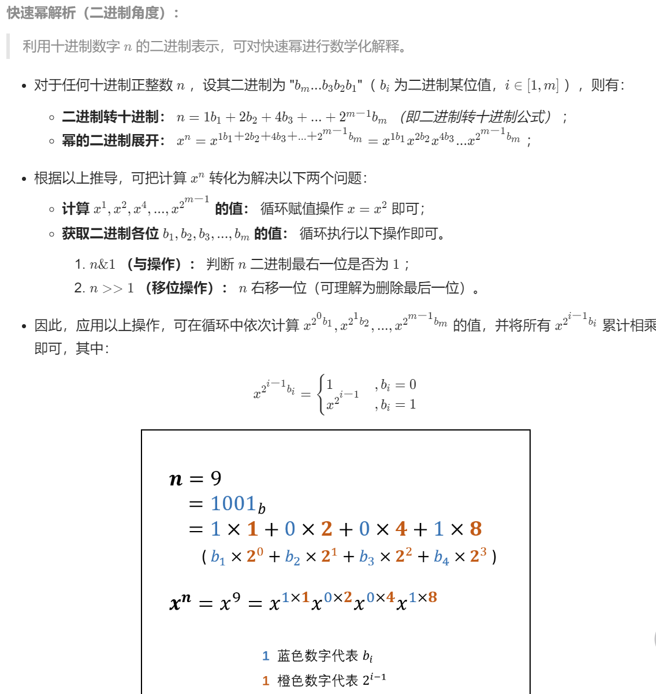
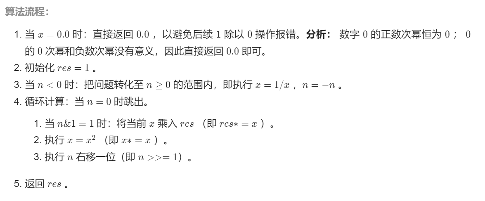
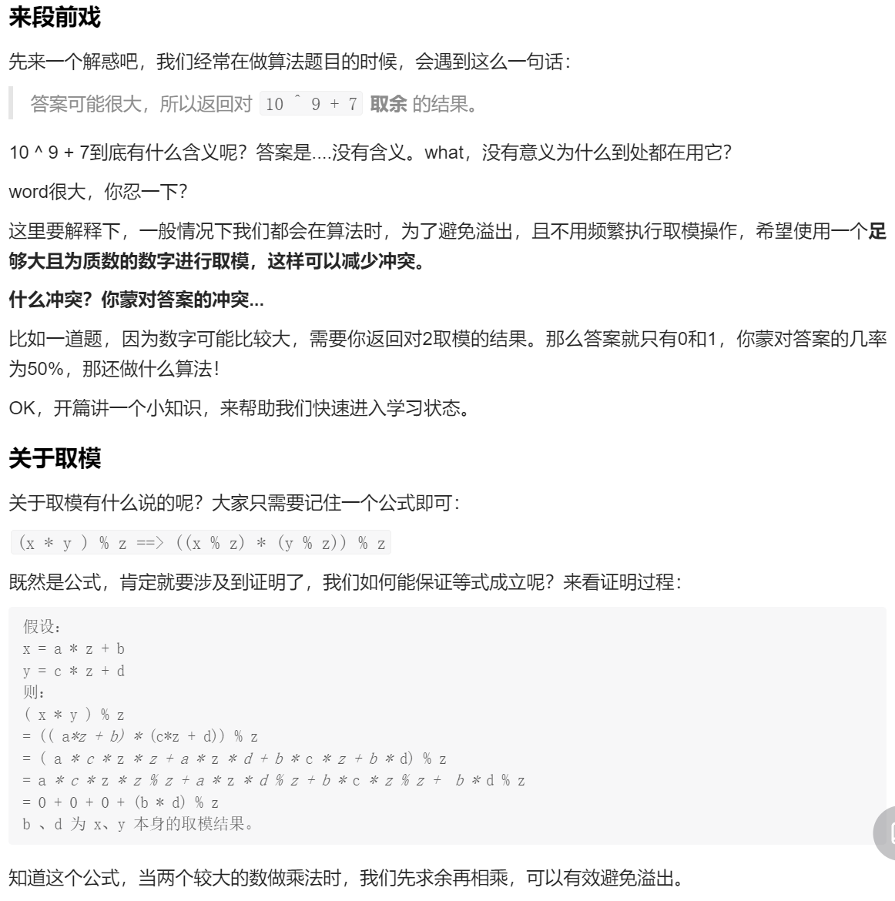

### <center>位运算技巧
#### 有趣小技巧
##### <font color = green>判断两个数是否异号</font>
```
x^y < 0 // true
x^y > 0 // false
```
##### <font color = green>加减一</font>
```
// 加一
let n = 1
n = ~^n
// 现在 n = 2

// 减一
let n = 2
n = ^~n
// 现在 n = 1
```
#### 算法常用操作
##### <font color = green>消除 n 的二进制中最后一位 1</font>
```
n & n - 1
// 用途：位1的个数、判断一个数是不是 2 的指数（如果一个数是 2 的指数，那么该数的二进制中只会有一个 1）
```
##### <font color = green>某个元素只出现一次以外, 其余每个元素均出现两次, 找出那个只出现了一次的元素</font>
```
a ^ a = 0
a ^ 0 = a
```
##### <font color = green>低位的 0 变成 1</font>
```
n = n | (n+1)
```
##### <font color = green>低位的 1 变成 0</font>
```
n = n & (n-1)
```
##### <font color = green>快速幂算法</font>
```
var myPow = function(x, n) {
    if (x == 0) {
        return 0
    }
    let res = 1
    if (n < 0) {
        n = -n
        x = 1/x
    }
    while (n != 0) {
        if (n & 1) {
            res = res * x
        } 
        x = x*x
        n = n >>> 1 // 进行无符号右移1位，此处不能使用有符号右移（>>）
    }
    return res
};
```
1. 理论分析

2. 算法流程

##### <font color = green>有符号位移(<<、>>>>) vs 无符号位移(<<<,>>>)</font>
* 无符号右移：正负数在最高位均补0，
* 有符号右移：正数的最高位补0，负数的最高位补1
##### <font color = green>取模问题</font>



