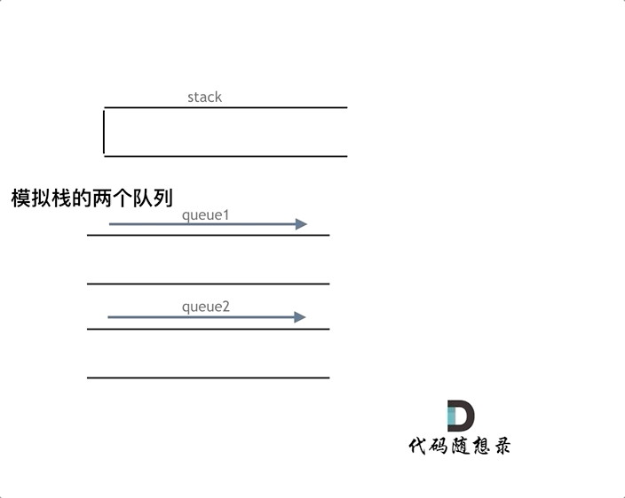

### point1: 栈实现队列
核心关键点：
point1.1: implement-queue-using-stacks

### point2: 队列实现栈
核心关键点：
point2.1：implement-stack-using-queues

### point3: 栈的应用
核心关键点：匹配问题都是栈的强项
point3.1: valid-parentheses  
point3.2: remove-all-adjacent-duplicates-in-string  
point3.3: evaluate-reverse-polish-notation  

### point4: 单调队列
核心关键点：队列没有必要维护窗口里的所有元素，只需要维护有可能成为窗口里最大值的元素就可以了，同时保证队列里的元素数值是由大到小的  

point4.1: sliding-window-maximum

### point5: 优先队列(小顶堆/大顶堆)
核心关键点：使用优先级队列来对部分频率进行排序  
point5.1: top-k-frequent-elements